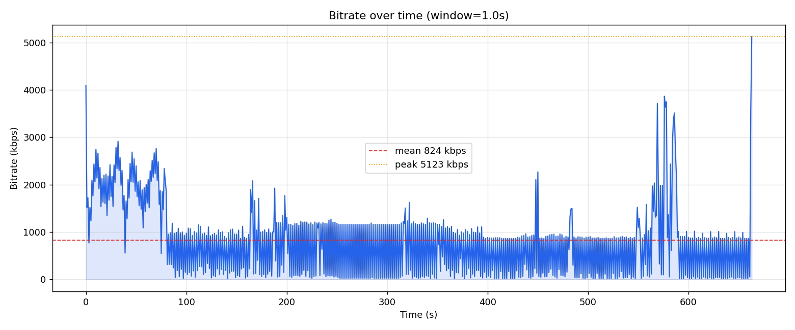

# Video Bitrate Analyzer
Extracts per-packet data from a video file using `ffprobe`, computes windowed bitrate statistics, and outputs charts.

## Output

- **Terminal report:** duration, packet count, total size, overall/mean/median/min/max bitrate, std dev, P90/P95/P99, peak-to-mean ratio (burstiness), coefficient of variation (rate-change intensity).
- **3 PNG charts:** bitrate over time, bitrate distribution histogram, bitrate change rate.

## Requirements

- Python 3.9+
- `ffmpeg` / `ffprobe` on PATH
- `pip install numpy matplotlib`

## Usage

```bash
python bitrate_analyzer.py video.mp4
python bitrate_analyzer.py video.mp4 --window 0.5 --outdir ./charts
```

| Flag | Default | Description |
|------|---------|-------------|
| `--window` | `1.0` | Time window in seconds for bitrate sampling |
| `--stream` | `v:0` | ffprobe stream selector |
| `--outdir` | `bitrate_out` | Output directory for chart PNGs |
